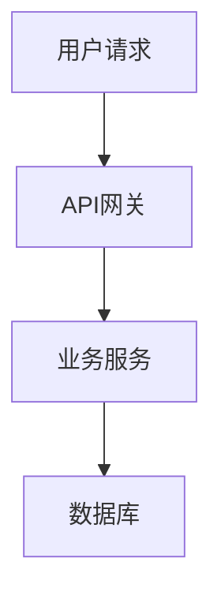

# DeepWiki 文档结构通用规范

**版本**: 1.2.1
**创建日期**: 2026-02-03
**更新日期**: 2026-03-10
**适用范围**: 任何软件项目的 DeepWiki 文档生成

---

## 1. 概述

本规范基于对 17 个优秀开源项目 DeepWiki 文档的系统性分析，提取通用模式和最佳实践，为任何软件项目的 DeepWiki 文档生成提供指导。

### 1.1 规范目标

- 提供通用的文档结构模板
- 定义页面内容标准
- 建立质量评估体系
- 支持 AI 自动化文档生成

### 1.2 分析样本

| 序号 | 项目 | 类型 | 组织模式 | 主章节数 |
|------|------|------|----------|----------|
| 1 | RAGFlow | RAG 框架 | 技术功能导向 | 9 |
| 2 | Milvus | 向量数据库 | 技术架构导向 | 10 |
| 3 | LangChain | LLM 框架 | 包生态导向 | 10 |
| 4 | Dify | AI 应用平台 | 产品功能导向 | 10 |
| 5 | LlamaIndex | RAG 框架 | 模块化架构导向 | 10 |
| 6 | Haystack | RAG 框架 | 组件-管道导向 | 10 |
| 7 | Qdrant | 向量数据库 | 分层架构导向 | 9 |
| 8 | FastGPT | AI 应用平台 | 产品功能导向 | 9 |
| 9 | Transformers | ML 框架 | 模型定义框架导向 | 9 |
| 10 | vLLM | 推理引擎 | 推理引擎架构导向 | 9 |
| 11 | PyTorch | 深度学习框架 | 核心系统导向 | 10 |
| 12 | TensorFlow | 深度学习框架 | 编译器基础设施导向 | 6 |
| 13 | Spark | 大数据框架 | 多模块项目导向 | 7 |
| 14 | Elasticsearch | 搜索引擎 | 分布式系统导向 | 9 |
| 15 | Redis | 内存数据库 | 内存数据库导向 | 10 |
| 16 | Grafana | 可观测性平台 | 全栈 Monorepo 导向 | 12 |
| 17 | Kubernetes | 容器编排 | 控制平面/数据平面导向 | 8 |

**统计结论**: 平均 9.2 个主章节，推荐 8-12 个

---

## 2. 文档结构规范

### 2.1 目录层级

| 层级 | 说明 | 示例 | 数量范围 |
|------|------|------|----------|
| 一级 | 主章节 | 1. Overview | 6-12 个（推荐 9 个） |
| 二级 | 子章节 | 1.1 System Architecture | 20-35 个 |
| 三级 | 细分章节（可选） | 1.1.1 Core Components | 按需 |

### 2.2 编号规则

使用数字编号，层级用点号分隔：

```
1. Overview
   1.1 System Architecture
   1.2 Key Concepts
2. Core Architecture
   2.1 Component System
   2.2 Data Flow
```

### 2.3 必备章节

| 章节 | 出现率 | 必要性 | 说明 |
|------|--------|--------|------|
| Overview/Introduction | 100% | 必需 | 项目概述、定位、核心功能 |
| System Architecture | 94% | 必需 | 系统架构、核心概念、数据流 |
| Core Components | 88% | 必需 | 核心组件或模块详解 |
| Build/Development | 82% | 推荐 | 构建系统、开发环境 |
| API/Service | 76% | 推荐 | API 接口、服务端点 |
| Configuration | 76% | 推荐 | 配置系统、环境变量 |
| Deployment | 65% | 可选 | 部署方式、Docker、生产环境 |
| Testing | 65% | 可选 | 测试框架、CI/CD |

### 2.4 通用章节模板

```
1. 概述
   - 项目介绍和定位
   - 核心功能和能力
   - 技术栈概览

2. 系统架构
   - 架构概述图
   - 核心概念和术语
   - 数据流和交互

3. 核心组件
   - [根据项目自动识别核心模块]
   - 每个组件的职责和接口

4. [领域特定章节]
   - 根据项目类型动态生成
   - 参考"组织模式选择"章节

5. API 与服务
   - API 架构设计
   - 端点列表和说明
   - 认证和授权

6. 配置
   - 配置系统架构
   - 环境变量说明
   - 参数详解

7. 部署
   - 部署架构
   - Docker/容器化
   - 生产环境配置

8. 开发
   - 开发环境搭建
   - 测试框架
   - CI/CD 流程
```

---

## 3. 语言与格式规范

本节是 `deepwiki` 语言、图表、页面元素与格式约束的唯一维护位置；`SKILL.md` 只保留触发入口与流程骨架，不重复定义细则。

### 3.1 语言要求

| 项目 | 要求 | 说明 |
|------|------|------|
| 文档正文 | **简体中文** | 所有说明性文字使用简体中文 |
| 章节标题 | **简体中文** | 如"系统概述"、"核心架构" |
| 代码注释 | **简体中文** | 代码示例中的注释使用中文 |
| 表格内容 | **简体中文** | 表格中的说明文字使用中文 |

### 3.2 图表要求

| 项目 | 要求 | 说明 |
|------|------|------|
| Mermaid 节点 | **简体中文** | 节点标签使用中文，如 `A[用户请求]` |
| Mermaid 连接线 | **简体中文** | 连接线标签使用中文，如 `-->|处理|` |
| 流程图 | **简体中文** | 所有流程步骤使用中文描述 |
| 架构图 | **简体中文** | 组件名称和说明使用中文 |

**示例**：


### 3.3 格式约束

| 约束 | 说明 |
|------|------|
| **禁止 emoji** | 文档中禁止使用任何 emoji 表情符号 |
| **专业风格** | 保持技术文档的专业性和严谨性 |
| **统一术语** | 同一概念使用统一的中文术语 |

---

## 4. 页面内容规范

### 4.1 页面元素清单

| 元素 | 必需性 | 说明 |
|------|--------|------|
| 标题 | 必需 | 章节标题，使用简体中文 |
| 相关源文件 | 必需 | 相关源文件列表 |
| 目的与范围 | 必需 | 目的与范围说明 |
| 正文内容 | 必需 | 详细技术说明 |
| Mermaid 图表 | 推荐 | 架构图、流程图、序列图（中文标注） |
| 代码示例 | 推荐 | 关键代码片段（中文注释） |
| 表格 | 推荐 | 参数、配置、API 说明 |
| 源码引用 | 推荐 | 指向具体代码行 |

### 4.2 源文件列表格式

```markdown
相关源文件：
- path/to/file1.py
- path/to/file2.py
- path/to/config.yaml
```

### 4.3 源码引用格式

```markdown
[filename.py:line-range]()
```

示例：`[rag/nlp/search.py:294-337]()`

### 4.4 Mermaid 图表规范

| 图表类型 | 用途 | 语法 |
|----------|------|------|
| 流程图 | 数据流、执行流程 | `graph TB` / `graph LR` |
| 序列图 | 组件交互、API 调用 | `sequenceDiagram` |
| 类图 | 类关系、继承结构 | `classDiagram` |
| 状态图 | 状态转换、生命周期 | `stateDiagram-v2` |

**注意**：所有图表中的文字必须使用简体中文。

### 4.5 表格使用场景

| 场景 | 列定义示例 |
|------|------------|
| 配置参数 | 参数名、类型、默认值、说明 |
| API 端点 | 方法、路径、参数、响应 |
| 组件对比 | 组件名、功能、适用场景 |
| 技术栈 | 组件、技术、版本 |
| 核心概念 | 概念、说明、示例 |

---

## 5. 组织模式选择

### 5.1 模式分类

根据项目类型选择合适的文档组织模式：

| 模式 | 适用项目类型 | 特点 | 代表项目 |
|------|--------------|------|----------|
| 技术架构导向 | 基础设施、数据库、中间件 | 按系统组件组织 | Milvus, Redis |
| 产品功能导向 | 应用平台、SaaS 产品 | 按产品功能模块组织 | Dify, FastGPT |
| 模块化架构导向 | 框架、SDK、库 | 按包/模块组织 | LlamaIndex, LangChain |
| 组件-管道导向 | 数据处理、ETL 框架 | 按组件和管道组织 | Haystack |
| 分层架构导向 | 分层设计的系统 | 按架构层次组织 | Qdrant |
| 分布式系统导向 | 分布式数据库、搜索引擎 | 按分布式组件组织 | Elasticsearch, Spark |
| 编译器基础设施导向 | 编译器、运行时 | 按编译流水线组织 | TensorFlow |
| 控制平面/数据平面导向 | 容器编排、云原生 | 按控制/数据平面组织 | Kubernetes |
| 全栈 Monorepo 导向 | 全栈应用 | 按前后端分离组织 | Grafana |

### 5.2 模式选择决策树

```
项目类型判断：
├── 是否为基础设施/数据库？
│   ├── 是否为分布式系统？
│   │   └── 是 → 分布式系统导向
│   └── 否 → 技术架构导向
├── 是否为应用平台/产品？
│   ├── 是否为全栈 Monorepo？
│   │   └── 是 → 全栈 Monorepo 导向
│   └── 否 → 产品功能导向
├── 是否为框架/SDK/库？
│   └── 是 → 模块化架构导向
├── 是否为数据处理框架？
│   └── 是 → 组件-管道导向
├── 是否为编译器/运行时？
│   └── 是 → 编译器基础设施导向
├── 是否为容器编排/云原生？
│   └── 是 → 控制平面/数据平面导向
└── 其他 → 根据核心抽象选择
```

### 5.3 项目类型判断指南

1. **检查主要编程语言**
   - C/C++/Rust → 可能是基础设施/编译器
   - Python → 可能是 AI/ML 框架
   - Go → 可能是云原生/分布式系统
   - TypeScript + Go/Python → 可能是全栈应用

2. **检查核心抽象**
   - 有 Pipeline/Workflow → 组件-管道导向
   - 有 Model/Inference → AI/ML 框架
   - 有 Cluster/Node → 分布式系统
   - 有 Frontend/Backend → 全栈应用
   - 有 MLIR/IR/Dialect → 编译器基础设施

3. **检查目录结构**
   - packages/ + pkg/ → 全栈 Monorepo
   - cmd/ + pkg/ → Go 项目
   - src/ + tests/ → 标准项目

---

## 6. 各模式章节模板

**技术架构导向**（适用于数据库、中间件）：
```
1. 系统概述
2. 系统架构
3. 核心组件
   - 组件 A
   - 组件 B
4. 数据操作
5. 查询处理
6. 配置系统
7. 部署指南
8. 开发指南
```

**产品功能导向**（适用于应用平台）：
```
1. 系统概述
2. 系统架构
3. [核心功能模块 A]
4. [核心功能模块 B]
5. API 系统
6. 前端界面
7. 部署指南
8. 开发指南
```

**模块化架构导向**（适用于框架/库）：
```
1. 系统概述
2. 架构设计
3. 核心框架
4. [集成模块 A]
5. [集成模块 B]
6. 开发指南
```

**分布式系统导向**（适用于分布式数据库、搜索引擎）：
```
1. 系统概述
2. 系统架构
3. 集群协调
4. 存储引擎
5. 查询处理
6. 复制与高可用
7. 安全机制
8. 配置系统
9. 开发指南
```

**编译器基础设施导向**（适用于编译器、运行时）：
```
1. 系统概述
2. 编译器架构
3. 中间表示系统
4. 编译流水线
5. 后端代码生成
6. 优化passes
7. 构建系统
8. 开发指南
```

**控制平面/数据平面导向**（适用于容器编排、云原生）：
```
1. 系统概述
2. 架构设计
3. 控制平面组件
4. 节点组件
5. 调度系统
6. 网络系统
7. 配置系统
8. 开发指南
```

**全栈 Monorepo 导向**（适用于全栈应用）：
```
1. 系统概述
2. 架构设计
3. 前端架构
4. 后端服务
5. API 服务器
6. 存储层
7. 插件系统
8. 构建系统
9. 开发指南
```

### 6.1 项目类型特定章节

#### 分布式系统
- 集群协调
- 领导选举
- 复制与高可用
- 一致性保证

#### 编译器项目
- 编译流水线
- 中间表示/方言
- 后端代码生成
- 优化passes

#### 全栈项目
- 前端架构
- 后端服务
- API 服务器
- 构建系统

#### 容器编排
- 控制平面
- 节点组件
- 调度系统
- 网络系统

#### AI/ML 框架
- 模型加载与管理
- 推理管道
- 内存与缓存
- 集成与连接器

#### 向量数据库
- 存储引擎
- 索引系统（如 HNSW, IVF）
- 查询处理
- 分布式架构

#### RAG 框架
- 管道与工作流
- 文档处理
- 检索系统
- LLM 集成

---

## 7. 元数据规范

### 7.1 文档级元数据

| 字段 | 说明 | 格式 | 示例 |
|------|------|------|------|
| 仓库名称 | owner/repo | 字符串 | `owner/project` |
| 提交哈希 | 生成时的 commit | 8位哈希 | `a1b2c3d4` |
| 生成时间 | ISO 8601 | 时间戳 | `2026-02-03T10:00:00` |
| 最后索引 | 人类可读 | 日期 | `2026年2月3日` |

### 7.2 版本关联格式

```markdown
最后索引：2026年2月3日 (a1b2c3d4)
```

---

## 8. 质量评估体系

### 8.1 评估维度

| 维度 | 权重 | 评估标准 |
|------|------|----------|
| 结构清晰度 | 25% | 层次分明、导航便捷、逻辑连贯 |
| 内容完整度 | 25% | 覆盖核心功能、无重大遗漏 |
| 技术深度 | 25% | 架构图完整、代码示例充分 |
| 实用性 | 25% | 部署指南、配置说明、开发文档 |

### 8.2 质量检查清单

**必需项**：
- [ ] 包含"系统概述"章节
- [ ] 包含"系统架构"章节
- [ ] 每个页面有"相关源文件"列表
- [ ] 核心架构有 Mermaid 图表（中文标注）
- [ ] 文档使用简体中文撰写
- [ ] 不包含 emoji 表情

**推荐项**：
- [ ] 配置参数有表格说明
- [ ] API 端点有完整文档
- [ ] 包含部署指南
- [ ] 包含开发环境配置
- [ ] 关键代码有源码引用

---

## 9. 附录

### 9.1 参考项目

| 项目 | DeepWiki 链接 | 推荐参考点 |
|------|---------------|------------|
| RAGFlow | https://deepwiki.com/infiniflow/ragflow | RAG 系统文档结构 |
| Milvus | https://deepwiki.com/milvus-io/milvus | 分布式系统文档 |
| LangChain | https://deepwiki.com/langchain-ai/langchain | 框架生态文档 |
| Dify | https://deepwiki.com/langgenius/dify | 产品平台文档 |
| LlamaIndex | https://deepwiki.com/run-llama/llama_index | 模块化文档 |
| Haystack | https://deepwiki.com/deepset-ai/haystack | 组件系统文档 |
| Qdrant | https://deepwiki.com/qdrant/qdrant | 向量数据库文档 |
| FastGPT | https://deepwiki.com/labring/FastGPT | AI 平台文档 |
| Transformers | https://deepwiki.com/huggingface/transformers | ML 框架文档 |
| vLLM | https://deepwiki.com/vllm-project/vllm | 推理引擎文档 |
| PyTorch | https://deepwiki.com/pytorch/pytorch | 深度学习框架文档 |
| TensorFlow | https://deepwiki.com/tensorflow/tensorflow | 编译器基础设施文档 |
| Spark | https://deepwiki.com/apache/spark | 大数据框架文档 |
| Elasticsearch | https://deepwiki.com/elastic/elasticsearch | 搜索引擎文档 |
| Redis | https://deepwiki.com/redis/redis | 内存数据库文档 |
| Grafana | https://deepwiki.com/grafana/grafana | 全栈平台文档 |
| Kubernetes | https://deepwiki.com/kubernetes/kubernetes | 容器编排文档 |

### 9.2 相关文档

- AI Skills 定义：[SKILL.md](./SKILL.md)

### 9.3 版本历史

| 版本 | 日期 | 变更说明 |
|------|------|----------|
| 1.0.0 | 2026-02-03 | 初始版本，基于 10 个项目分析 |
| 1.1.0 | 2026-02-04 | 扩展到 17 个项目，增加 4 种组织模式，增加项目类型特定章节 |
| 1.2.0 | 2026-02-04 | 增加语言与格式规范，要求简体中文撰写，禁止 emoji |
| 1.2.1 | 2026-03-10 | 明确本文件为语言与格式细则的唯一维护位置 |

